# AWS-SSO-Template
It's an open source project for business to setup SSO service with AWS SSO within 30 mins

Clone this repo on your local first

### Step 1:
Install ASCENDING SSO App from your Azure AD Gallary. 
- Go to your Azure AD and record your **tenant ID** 
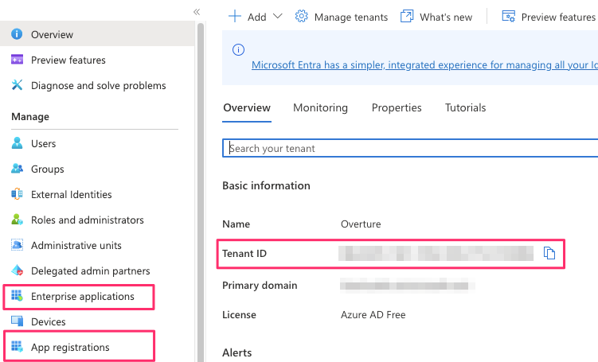 
- Click Enterprise applications, Click + New application and Search for ASCENDING app 
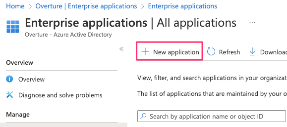 
- After downloading this app, go to App registrations and select ASCENDING app, record its **application (client) ID** 
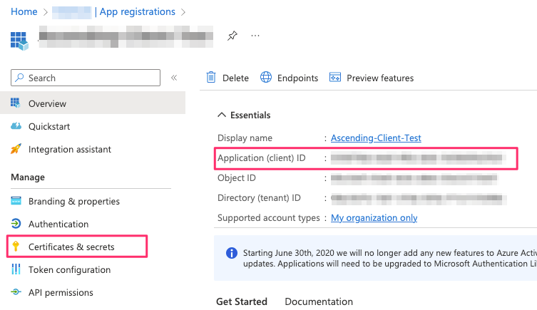 
- Click Certificates & secrets to create a new client secret and record the **secret value** 
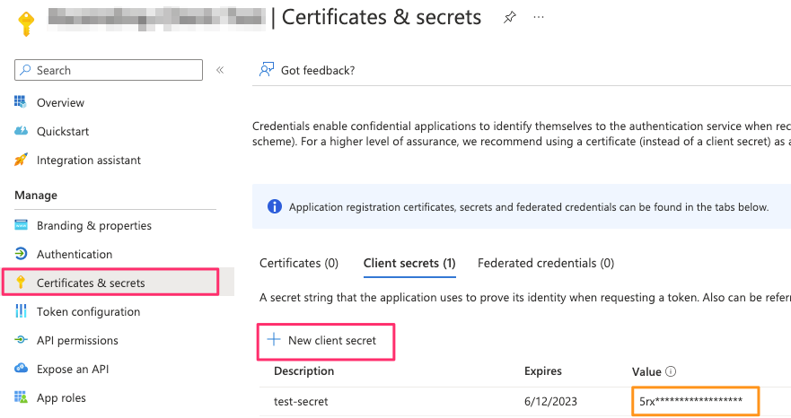 

### Step 2:
Enable SSO service in your AWS console
- Log in your AWS console, go to IAM Identity Center, enable it if not alreay, and go to settings, click **Actions** and choose **Change identity source** 
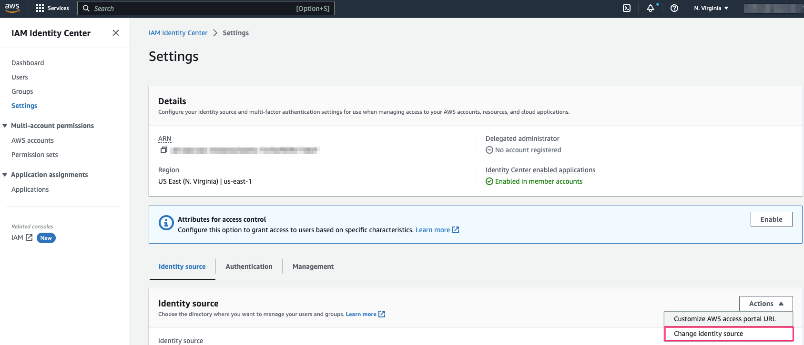 
- Choose **External identity provider** and click next 

- Record **IAM Identity Center Assertion Consumer Service (ACS) URL** and **IAM Identity Center issuer URL** 
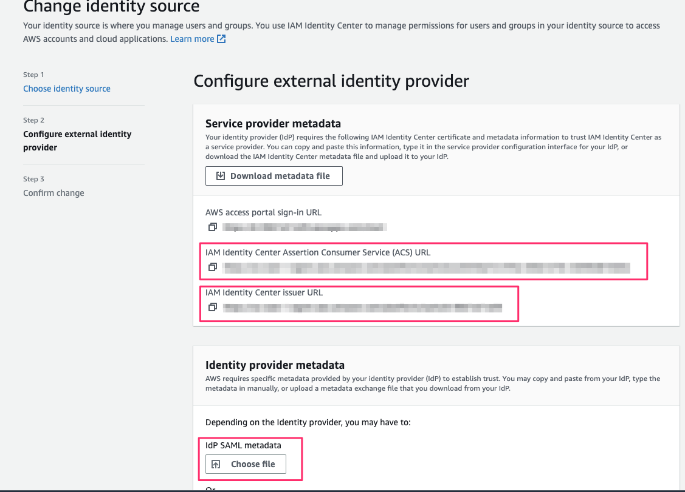 
- Keep this page open, we need to upload a metadata file for **IDP SAML metadata** under Identity provider metadata section 

### Step 3:
Deploy cloudformation templates provided in this repo  
**Prerequisite: install AWS sam cli and AWS cli** 
- Deploy **azure-parameters-step-1.yaml** in your AWS console first, and input the values recorded from **step 1** and **step 2** accordingly 
Leave **SCIMEndpoint** and **AccessToken** parameters as default for now 

- Open your terminal, and go to the root directory of this repo 
- Run the following sam commands to build and deploy **azure-sso-app-step-2.yaml** 
        
        sam build -t ./cft/azure-sso-app-step-2.yaml
    <!-- tsk -->
        sam deploy --resolve-s3 --stack-name <the name for this stack> --capabilities CAPABILITY_NAMED_IAM --region <your aws region> --parameter-overrides ParameterStack=<the stack name of the azure-parameters-step-1.yaml template>

- There are two lambdas will be created in your AWS account, run the **ProvisionClientAzureEnv** lamda function fisrt 
    Manually run the lambda function by creating an empty event 
    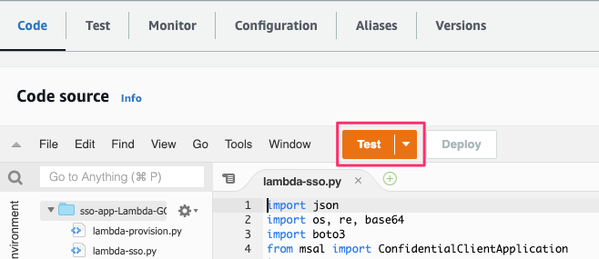 

- After this lambda function ran successfully: 
    1. There will be three sample groups created on your Azure AD account: read-only group, admin group, and power-user group 

    2. Go to your Azure AD and click Enterprise Applications, you will see an application called **AWS Signle Sign-on**. Click this app and navigate to **Single sign-on** on the left panel. Go to SAML Certificates section and download the **Federation Metadata XML** 

        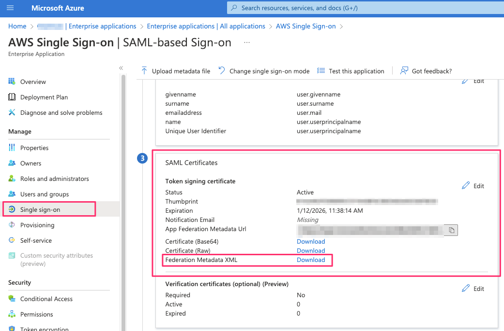 

    3. Upload the **Federation Metadata XML** file for **IdP SAML metadata** on the page where you opened on **STEP 2**, then you can click next to complete the setting of External identity provider 

         

## Setup auto provisoning between your AWS SSO and Azure AD

- After finishing the External identity provider settings, your AWS IAM identity center will have a message to ask you enable auto provisioning, click enable and record the **SCIMEndpoint** and **AccessToken** 

    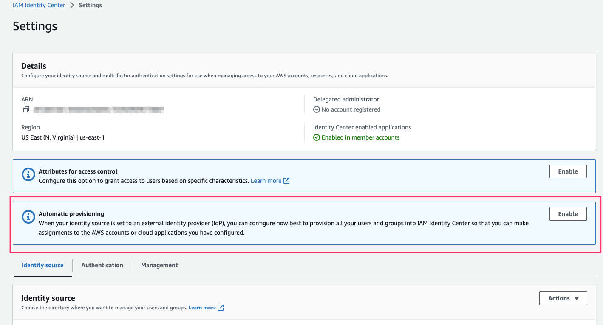 

- Update **azure-parameters-step-1.yaml** stack in your AWS console by providing **SCIMEndpoint** and **AccessToken** paramter values you just got 

- Run the second lamda function **ProvisionClientAWSEnv** to setup auto provisoning between you AWS and Azure AD 

- After the second lambda function ran successfully, the three groups created by the first lambda will be automatically synced to your AWS IAM Identity Center within 40 mins. If the auto provisioning did not work, go to the AWS Single Sign-on app on your Azure AD, and click **Provisioning** and Click **Restart provisioning** to reboot 

    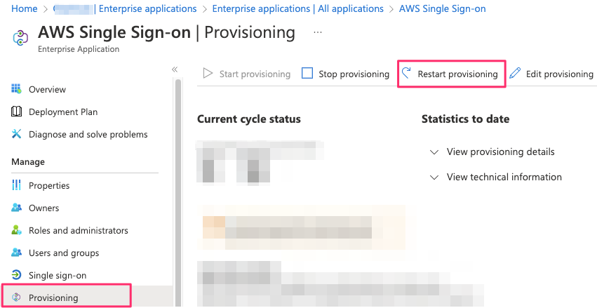 

## Configure AWS SSO Account Assignment on your AWS IAM Identity Center - optional

- From previous steps, there are three groups created on your Azure AD account and synced to your AWS IAM Identity Center, record each of the Group ID and your IAM Identity Center ARN 

    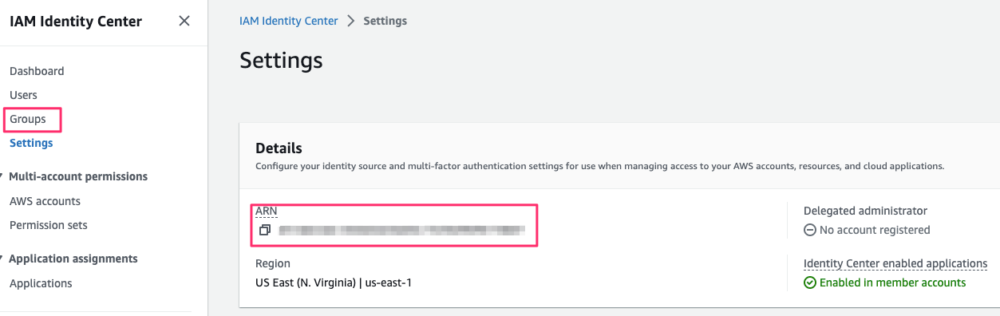 
    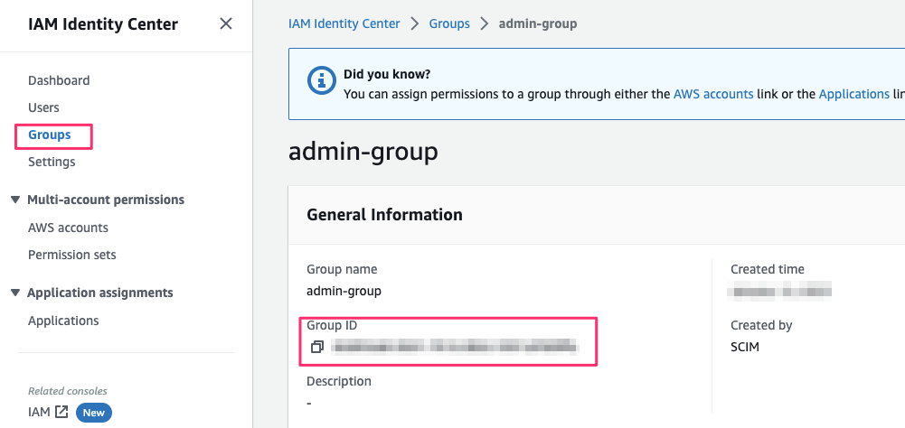 

- Deploy cloudformation template: **azure-sso-permission-step-3.yaml** provided in this repo and input the paramters you got from previous step to create the corresponding permission sets, associated them with each of the gourps, and attached to your AWS account so that users in the groups can use SSO 

- Lastly, the Azure AD users has been added to your groups can login to your AWS account by going to the start URL on your IAM Identy Center 
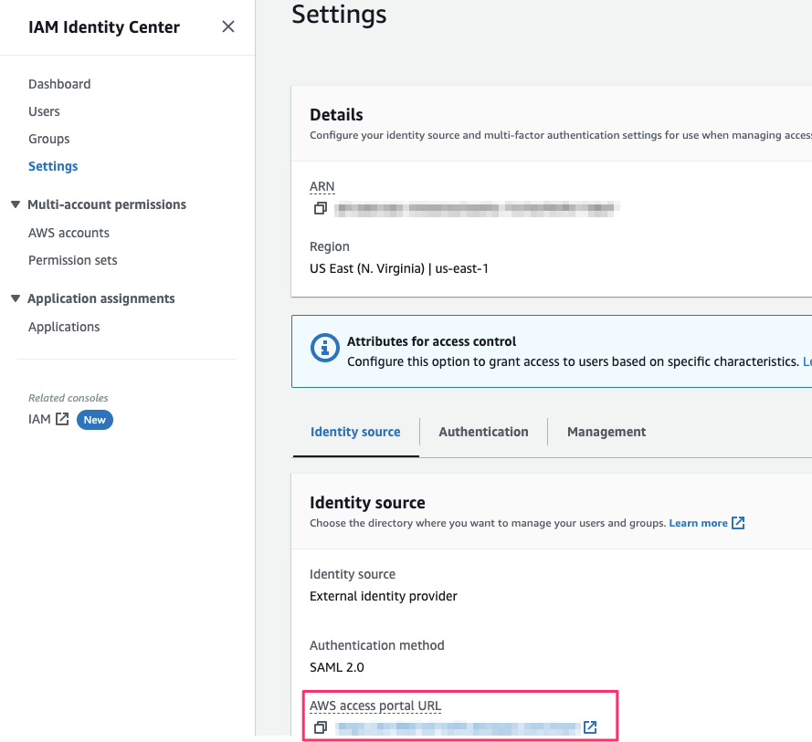 

